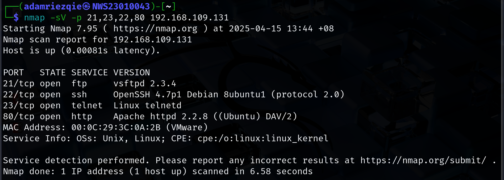
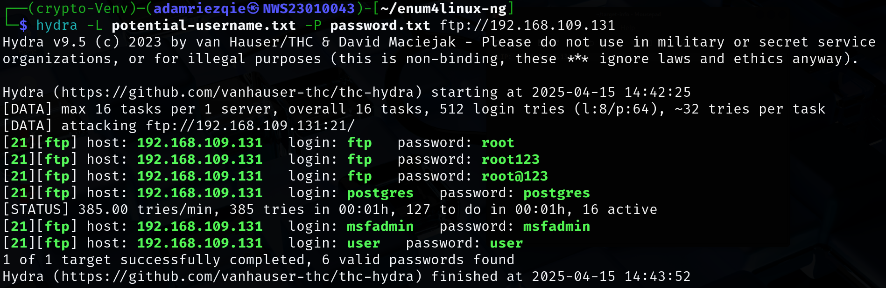
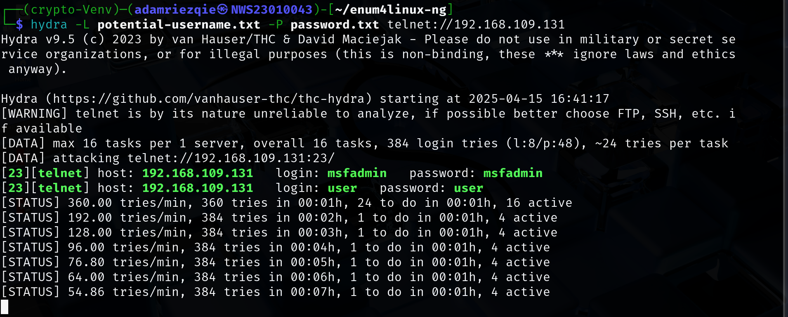

# Lab 1: Cryptographic Attacks: Brute Force and Traffic Analysis on Network Protocols

## 🎯 Objective

1. Explore **vulnerabilities** in common network protocols (FTP, TELNET, SSH & HTTP).
3. Perform brute force attacks to recover passwords.
4. Use recovered credentials to sniff network traffic.
5. Analyze the security posture of each protocol.
6. Propose effective mitigation strategies.
---

## 🛠️ Requirement

| Tool               | Purpose                        |
|--------------------|--------------------------------|
| Kali Linux         | Attacker machine               |
| Metasploitable 2   | Target/vulnerable machine      |
| Wordlist           | Password brute-forcing         |
| Nmap               | Port scanning                  |
| Hydra              | Brute force tool               |
| Burp Suite         | HTTP interception & testing    |
| enum4linux-ng      |                                |
| Python3            |                                |

---

## 🔥 Pre-Heat
1. Performed a port scan using Nmap:
   ```
   nmap -sV -p 21,23,22,80 [target-ip]
   ```
   | Option              | Meaning                                                                                                         |
   |---------------------|-----------------------------------------------------------------------------------------------------------------|
   | `nmap`              | Runs the Nmap network scanner tool.                                                                               |
   | `-sV`               | **Service/version detection** — Nmap will try to determine what software and version is running on each open port.    |
   | `-p 21,23,22,80`    | Tells Nmap to scan **only** these specific ports: <br>• `21` = FTP <br>• `23` = Telnet <br>• `22` = SSH <br>• `80` = HTTP    |
   | `[target-ip]`       | Replace with the IP address of the target/vulnerable machine you are scanning.                                     |

   - Result:
     
     > Here I only scan FTP(21), TELNET(23), SSH(22) and HTTP(80) port.

2. Create Python Virtual Enviroment:
   ```
   python3 -m venv crypto-Venv
   source crypto-Venv/bin/activate
   ```
3. Install enum4linux-ng:
   ```
      git clone https://github.com/cddmp/enum4linux-ng.git
      cd enum4linux-ng
      python3 -m pip install -r requirements.txt
   ```
---

## 🔍 Lab Tasks

### Task 1: Enumerate the Vulnerable VM to Discover Usernames

#### ✅ Objective:
- Identify potential usernames for brute force attacks.
---

#### 🚶‍♂️‍➡️ The Process:

1. Enumurate Username Using Enum4linux-ng:

   You may run this script like normal:
   ```
   python3 enum4linux-ng.py -A [target-ip]
   ```
   
   But my version will grep username only and append to username.txt. Useful for brute force tasks: 
   ```
   python3 enum4linux-ng.py -A [target-ip] | grep "username:" | sed 's/username: //' >> username.txt
   ```
   > Make sure run the script in enum4linux-ng directory   

   - Result:
      ```
      ┌──(crypto-Venv)─(adamriezqie㉿NWS23010043)-[~/enum4linux-ng]
      └─$ python3 enum4linux-ng.py -A 192.168.109.131 | grep "username:" | sed 's/username: //' >> username.txt

      ┌──(crypto-Venv)─(adamriezqie㉿NWS23010043)-[~/enum4linux-ng]
      └─$ cat username.txt 
        root
        daemon
        bin
        sys
        sync
        games
        man
        lp
        mail
        news
        uucp
        proxy
        www-data
        backup
        list
        irc
        gnats
        libuuid
        dhcp
        syslog
        klog
        sshd
        bind
        postfix
        ftp
        postgres
        mysql
        tomcat55
        distccd
        telnetd
        proftpd
        msfadmin
        user
        service
        nobody
      ```
      > Here I execute the script and filter the output to extract lines containing username:. Then, I strip the username: prefix and save the resulting usernames to a file named list.username.txt.
      
      **Potential usernames for brute force attacks:**
     
      ```
      ┌──(crypto-Venv)─(adamriezqie㉿NWS23010043)-[~/enum4linux-ng]
      └─$ cat potential-username.txt 
      root
      ftp
      postgres
      mysql
      tomcat55
      proftpd
      msfadmin
      user
      ```
      > Here, I narrowed down the list to potential usernames for brute force attacks. 

---

### Task 2: Perform Brute Force Attacks
   - For brute force attaks we need a two things:
        - potential-username.txt
        - password.txt

   - but how to get the password? There is many list online out there, but for this task we utilized ChatGPT for generate potential password based on the username:
        - [Password.txt](wordlist/password.txt)

   ---

#### 2.1: FTP, TELNET, and SSH

##### FTP:

For do brute force attack, I use Hydra:
   ```
      hydra -L potential-username.txt -P password.txt ftp://[target-ip]
   ```

   - Results:
     

   ---
   
##### TELNET:

   ```
      hydra -L potential-username.txt -P password.txt ftp://[target-ip]
   ```
   - Results:
     

   ---
   
##### SSH:

   ---

#### 2.2: HTTP

## 🎯 Objective

   1. Use Burp Intruder to automate brute force attacks against an HTTP login page.
   2. Configure Intruder to test a list of usernames and passwords.
   3. Analyze the results to identify successful logins.
---


