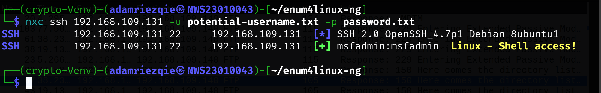
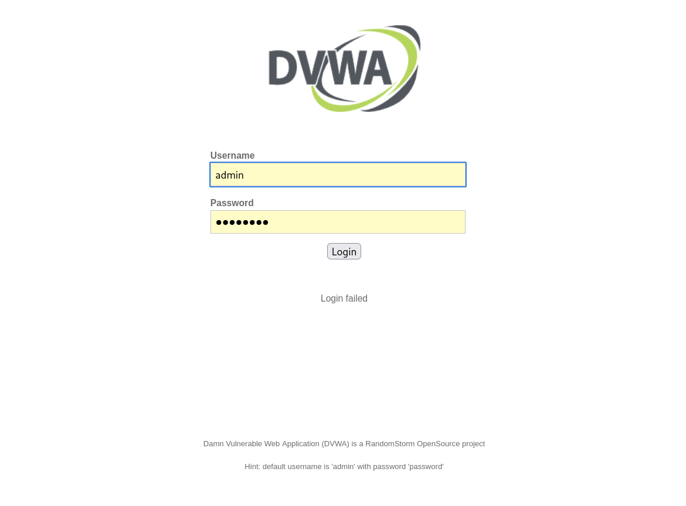
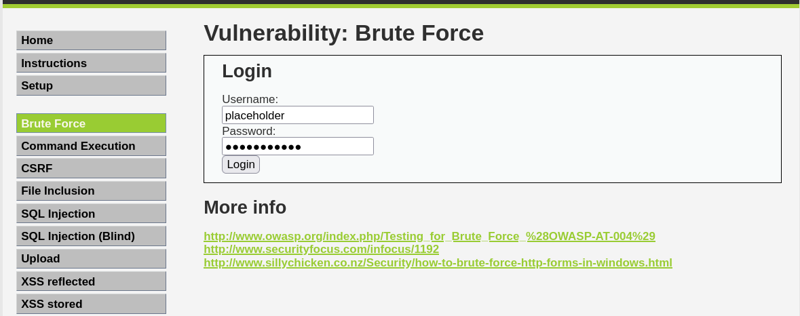
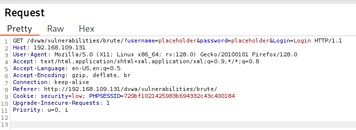
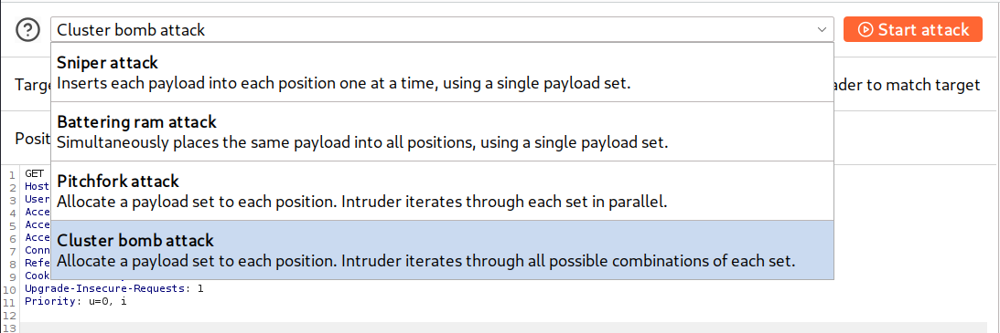
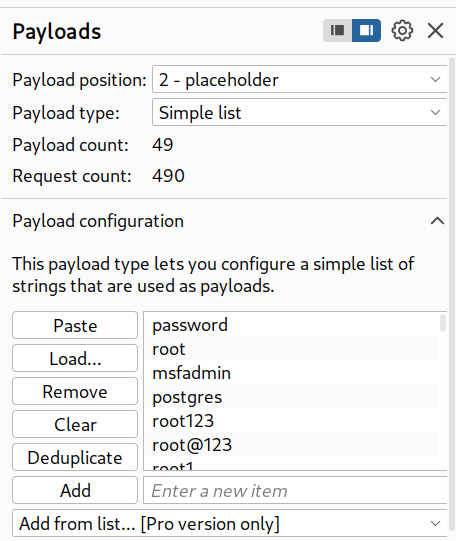
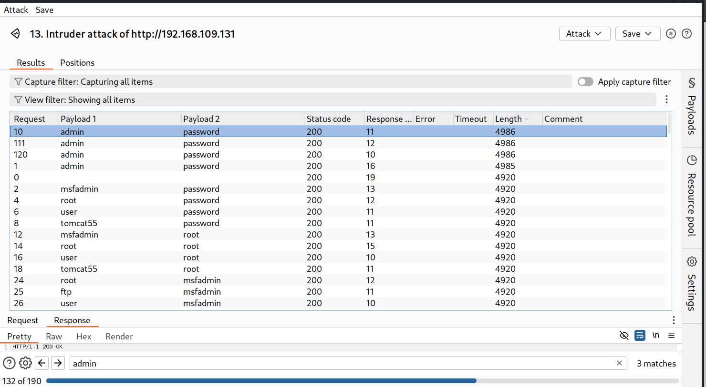
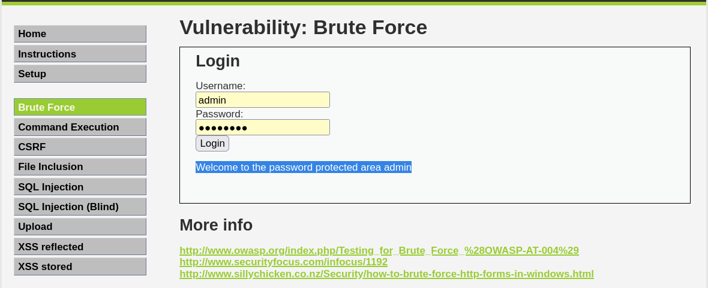
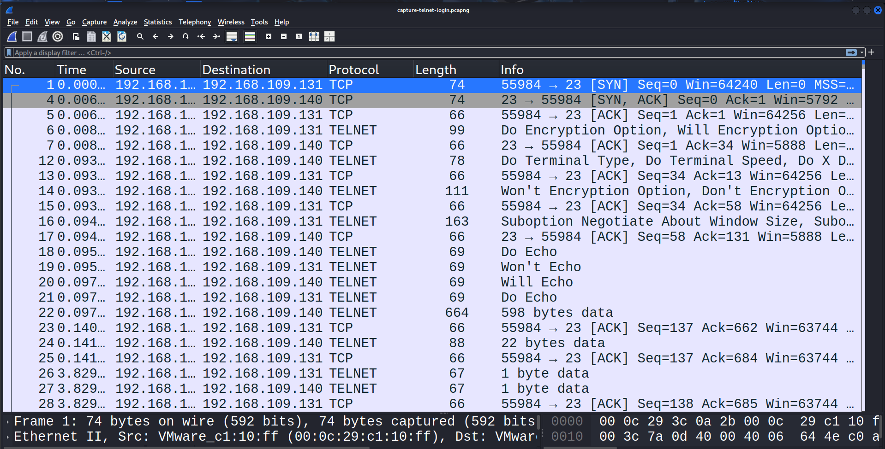
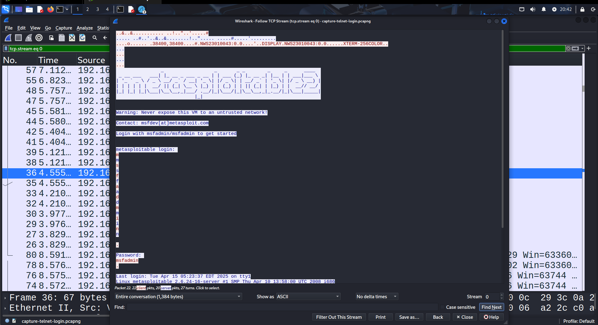

# Lab 1: Cryptographic Attacks: Brute Force and Traffic Analysis on Network Protocols

## 🎯 Objective

1. Explore **vulnerabilities** in common network protocols (FTP, TELNET, SSH & HTTP).
3. Perform brute force attacks to recover passwords.
4. Use recovered credentials to sniff network traffic.
5. Analyze the security posture of each protocol.
6. Propose effective mitigation strategies.
---

## 🛠️ Requirement

| Tool               | Purpose                        |
|--------------------|--------------------------------|
| Kali Linux         | Attacker machine               |
| Metasploitable 2   | Target/vulnerable machine      |
| Burp Suite         | HTTP interception & testing    |
| Python3            |                                |
| Wordlist           | Password brute-forcing         |
| Nmap               | Port scanning                  |
| Hydra              | Brute force tool               |
| enum4linux-ng      |                                |
| NetExec            |                                |

---

## 🔥 Pre-Heat
1. Performed a port scan using Nmap:
   ```
   nmap -sV -p 21,23,22,80 [target-ip]
   ```
   | Option              | Meaning                                                                                                         |
   |---------------------|-----------------------------------------------------------------------------------------------------------------|
   | `nmap`              | Runs the Nmap network scanner tool.                                                                               |
   | `-sV`               | **Service/version detection** — Nmap will try to determine what software and version is running on each open port.    |
   | `-p 21,23,22,80`    | Tells Nmap to scan **only** these specific ports: <br>• `21` = FTP <br>• `23` = Telnet <br>• `22` = SSH <br>• `80` = HTTP    |
   | `[target-ip]`       | Replace with the IP address of the target/vulnerable machine you are scanning.                                     |

   - Result:
     
     > Here I only scan FTP(21), TELNET(23), SSH(22) and HTTP(80) port.

2. Create Python Virtual Enviroment:
   ```
   python3 -m venv crypto-Venv
   source crypto-Venv/bin/activate
   ```
3. Install enum4linux-ng:
   ```
      git clone https://github.com/cddmp/enum4linux-ng.git
      cd enum4linux-ng
      python3 -m pip install -r requirements.txt
   ```
---

## 🔍 Lab Tasks

### Task 1: Enumerate the Vulnerable VM to Discover Usernames

#### ✅ Objective:
- Identify potential usernames for brute force attacks.
---

#### 🚶‍♂️‍➡️ The Process:

1. Enumurate Username Using Enum4linux-ng:

   You may run this script like normal:
   ```
   python3 enum4linux-ng.py -A [target-ip]
   ```
   
   But my version will grep username only and append to username.txt. Useful for brute force tasks: 
   ```
   python3 enum4linux-ng.py -A [target-ip] | grep "username:" | sed 's/username: //' >> username.txt
   ```
   > Make sure run the script in enum4linux-ng directory   

   - Result:
      ```
      ┌──(crypto-Venv)─(adamriezqie㉿NWS23010043)-[~/enum4linux-ng]
      └─$ python3 enum4linux-ng.py -A 192.168.109.131 | grep "username:" | sed 's/username: //' >> username.txt

      ┌──(crypto-Venv)─(adamriezqie㉿NWS23010043)-[~/enum4linux-ng]
      └─$ cat username.txt 
        root
        daemon
        bin
        sys
        sync
        games
        man
        lp
        mail
        news
        uucp
        proxy
        www-data
        backup
        list
        irc
        gnats
        libuuid
        dhcp
        syslog
        klog
        sshd
        bind
        postfix
        ftp
        postgres
        mysql
        tomcat55
        distccd
        telnetd
        proftpd
        msfadmin
        user
        service
        nobody
      ```
      > Here I execute the script and filter the output to extract lines containing username:. Then, I strip the username: prefix and save the resulting usernames to a file named list.username.txt.
      
      **Potential usernames for brute force attacks:**
     
      ```
      ┌──(crypto-Venv)─(adamriezqie㉿NWS23010043)-[~/enum4linux-ng]
      └─$ cat potential-username.txt 
      root
      ftp
      postgres
      mysql
      tomcat55
      proftpd
      msfadmin
      user
      ```
      > Here, I narrowed down the list to potential usernames for brute force attacks. 

---

### Task 2: Perform Brute Force Attacks
   - For brute force attaks we need a two things:
        - potential-username.txt
        - password.txt

   - but how to get the password? There is many list online out there, but for this task we utilized ChatGPT for generate potential password based on the username:
        - [Password.txt](wordlist/password.txt)

   ---

#### 2.1: FTP, TELNET, and SSH

##### FTP:

For do brute force attack on FTP and TELNET , I used Hydra:
   ```
      hydra -L potential-username.txt -P password.txt ftp://[target-ip]
   ```

   - Results:
     

   ---
   
##### TELNET:

   ```
      hydra -L potential-username.txt -P password.txt ftp://[target-ip]
   ```
   - Results:
     

   ---
   
##### SSH:

For do brute force attack on SSH , I used NetExec:
   ```
      nxc ssh [target-ip] -u potential-username.txt -p password.txt
   ```

   - Results:
     

   ---
   ---

#### 2.2: HTTP

## 🎯 Objective

   1. Use Burp Intruder to automate brute force attacks against an HTTP login page.
   2. Configure Intruder to test a list of usernames and passwords.
   3. Analyze the results to identify successful logins.

   #### 🚶‍♂️‍➡️ The Process:

   1. Login to DVWA (D*** Vulnerable Web App!)
      - Login from attacker device:
         

   2. Our Testing Page
      - Send a placeholder in login form:
         
         > make sure you enable the intercept in Burp Suite 

   3. Intercept Request
      - Right click and send to Intruder for bruteforce
         

   4. Select Attack Type:
      - Choose Cluster Bomb Attack:
         

   5. Setting up Payload:
      - Select potential-username.txt as a first payload for username:
      - 

      - Select password.txt as a second payload for password:
      - 

   6. Analyze the results to identify successful logins:
      - Click the lenght column for sort it:
         
         > We can see here payload "admin" "password" with most lenght

      - Open the respone tab:
         
         > As we can see here, we have successful attempt

   7. Login as admin:
      - Go back to the login form and try login:
         
         > Nice job buddy!

   
---

### Task 3: Sniff Network Traffic

## 🎯 Objective

1. Use the recovered credentials to log in to the respective services.
2. Use Wireshark or tcpdump to capture and analyze network traffic during the session.
3. Identify which protocols transmit data in plaintext and which use encryption.
4. Provide evidence (e.g., screenshots) to prove which protocols are secure and which are not.

   ---

      #### 🚶‍♂️‍➡️ The Process:
      
      a. Identify Protocol trasnmit data in plaintext:

         1. Open Wireshark on Attack device (Kali Linux)
         2. Choose eth0 (or channel that connect with metasploitable network)
         3. Start the scan
         4. Simulate the login attempt using real username:password we got for TELNET on Attacker Machine
         5. Go back to Wireshark:

            - Result:
               - 

         6. Sort the lenght column.
         7. Right click to the most lenght value > Follow > TCP Stream

            - Result:
               - 
                  > Here we capture data that transmit using telnet, which is not encrypted.


      b. Identify Protocol trasnmit data using encryption:


