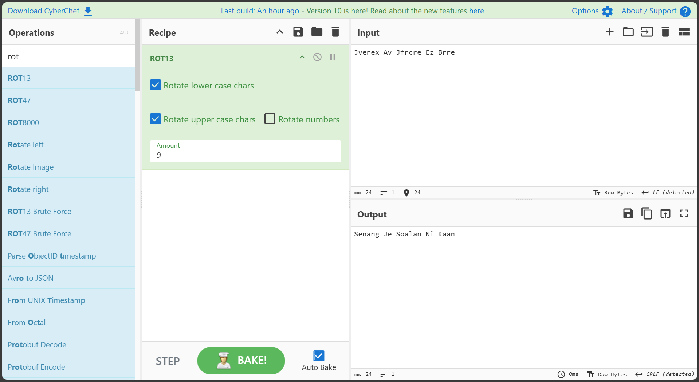

# Walkthrough Practical Test 1
> Here my walkthrough on how I apply my knowledge into this test.

---
## Task 1: Generate Your GPG Key Pair
Objective: Use `gpg` to generate an RSA key pair tied to your identity.

---
### Step 1: Generate
```bash
┌──(adamriezqie㉿NWS23010043)-[~]
└─$ gpg --full-generate-key
gpg (GnuPG) 2.2.46; Copyright (C) 2024 g10 Code GmbH
This is free software: you are free to change and redistribute it.
There is NO WARRANTY, to the extent permitted by law.

Please select what kind of key you want:
   (1) RSA and RSA (default)
   (2) DSA and Elgamal
   (3) DSA (sign only)
   (4) RSA (sign only)
  (14) Existing key from card
Your selection? 1
RSA keys may be between 1024 and 4096 bits long.
What keysize do you want? (3072) 4096
Requested keysize is 4096 bits
Please specify how long the key should be valid.
         0 = key does not expire
      <n>  = key expires in n days
      <n>w = key expires in n weeks
      <n>m = key expires in n months
      <n>y = key expires in n years
Key is valid for? (0) 1y
Key expires at Sat 16 May 2026 06:29:25 PM +08
Is this correct? (y/N) Y

GnuPG needs to construct a user ID to identify your key.

Real name: MUHAMMAD ADAM RIEZQIE BIN ALI HIRAHAM
Email address: muhammadadam.alihiraham@student.gmi.edu.my
Comment:
You selected this USER-ID:
    "MUHAMMAD ADAM RIEZQIE BIN ALI HIRAHAM <muhammadadam.alihiraham@student.gmi.edu.my>"

Change (N)ame, (C)omment, (E)mail or (O)kay/(Q)uit? O
We need to generate a lot of random bytes. It is a good idea to perform
some other action (type on the keyboard, move the mouse, utilize the
disks) during the prime generation; this gives the random number
generator a better chance to gain enough entropy.
We need to generate a lot of random bytes. It is a good idea to perform
some other action (type on the keyboard, move the mouse, utilize the
disks) during the prime generation; this gives the random number
generator a better chance to gain enough entropy.
gpg: /home/abu/.gnupg/trustdb.gpg: trustdb created
gpg: directory '/home/abu/.gnupg/openpgp-revocs.d' created
gpg: revocation certificate stored as '/home/abu/.gnupg/openpgp-revocs.d/244413E5B46029B88E0FFC399FC18FB47132CDB1.rev'
public and secret key created and signed.

pub   rsa4096 2025-05-16 [SC] [expires: 2026-05-16]
      244413E5B46029B88E0FFC399FC18FB47132CDB1
uid                      MUHAMMAD ADAM RIEZQIE BIN ALI HIRAHAM <muhammadadam.alihiraham@student.gmi.edu.my>
sub   rsa4096 2025-05-16 [E] [expires: 2026-05-16]


┌──(adamriezqie㉿NWS23010043)-[~]
└─$
```

---
### Step 2: List the output
```bash
┌──(adamriezqie㉿NWS23010043)-[~]
└─$ gpg --list-keys
gpg: checking the trustdb
gpg: marginals needed: 3  completes needed: 1  trust model: pgp
gpg: depth: 0  valid:   1  signed:   0  trust: 0-, 0q, 0n, 0m, 0f, 1u
gpg: next trustdb check due at 2026-05-16
/home/abu/.gnupg/pubring.kbx
----------------------------
pub   rsa4096 2025-05-16 [SC] [expires: 2026-05-16]
      244413E5B46029B88E0FFC399FC18FB47132CDB1
uid           [ultimate] MUHAMMAD ADAM RIEZQIE BIN ALI HIRAHAM <muhammadadam.alihiraham@student.gmi.edu.my>
sub   rsa4096 2025-05-16 [E] [expires: 2026-05-16]
```

---
## Task 2: Encrypt and Decrypt a File
Objective: Perform GPG encryption and decryption.

---
### Step 1: Create a file `message.txt`
```bash
┌──(adamriezqie㉿NWS23010043)-[~/…/4-Practical-Test/Practical-Test-1/src/Task-2]
└─$ echo "This file was encrypted by Adam Riezqie (NWS23010043)" > message.txt
```

---
### Step 2: Encrypt `message.txt` using `public key`
```bash

┌──(adamriezqie㉿NWS23010043)-[~/…/4-Practical-Test/Practical-Test-1/src/Task-2]
└─$ gpg --encrypt --recipient "MUHAMMAD ADAM RIEZQIE BIN ALI HIRAHAM" message.txt

┌──(adamriezqie㉿NWS23010043)-[~/…/4-Practical-Test/Practical-Test-1/src/Task-2]
└─$ ls
message.txt  message.txt.gpg  step.md

┌──(adamriezqie㉿NWS23010043)-[~/…/4-Practical-Test/Practical-Test-1/src/Task-2]
└─$ cat message.txt.gpg
�
��U��a���[FO�)ٗ��x�]Q���Jz�:�������>�yU1�?�N �R+��.kܛ�91B&�jQ����
y��I�T�8�r��+^���^��@k}y�'B{'���f�𴗉"T�l�?���O� jBk��H��'@��fq�l_�p�:5 F&�^�6߆�Ax=�
�W�q���~W�c�#�wi�
                 ��+w�?�Q5�_�
                             X1ug(�ִv�=��Z�ϯ�^�֮�i␦�c��,�1�UϐW�4���d��a6'
�R�rR�=��'�ECk}��F=����rt�iJ�\�?��7�Y��p_�A␦�w�a�g��vƛ��KN�q��C�
]d���~
�2I�b[�v�)␦+�4_�EK(�|>pV�[څM�Aq�H����o
x�c����PfU�!��6ɀ�|O�����]4��5g
-��8,|��O�;%?�]8
F{d�1���^��_�̥
             &�q����R�����H���0Lh�`�␦��H�}�kP���5<h�2p�M7-0ީ���M�8�qb��q                                                
┌──(adamriezqie㉿NWS23010043)-[~/…/4-Practical-Test/Practical-Test-1/src/Task-2]
└─$
```

---
### Step 3: `Decrypt` the resulting file and verify the contents.
```bash
┌──(adamriezqie㉿NWS23010043)-[~/…/4-Practical-Test/Practical-Test-1/src/Task-2]
└─$ gpg --output decrypted.txt --decrypt message.txt.gpg
gpg: encrypted with 4096-bit RSA key, ID 6B618E335CD69A3C, created 2025-05-16
      "MUHAMMAD ADAM RIEZQIE BIN ALI HIRAHAM <muhammadadam.alihiraham@student.gmi.edu.my>"

┌──(adamriezqie㉿NWS23010043)-[~/…/4-Practical-Test/Practical-Test-1/src/Task-2]
└─$
```
Enter `passphrase` from task-1

```bash
┌──(adamriezqie㉿NWS23010043)-[~/…/4-Practical-Test/Practical-Test-1/src/Task-2]
└─$ ls
decrypted.txt  message.txt  message.txt.gpg  step.md

┌──(adamriezqie㉿NWS23010043)-[~/…/4-Practical-Test/Practical-Test-1/src/Task-2]
└─$ cat decrypted.txt
This file was encrypted by Adam Riezqie (NWS23010043)

┌──(adamriezqie㉿NWS23010043)-[~/…/4-Practical-Test/Practical-Test-1/src/Task-2]
└─$
```

---
## Task 3: Sign and Verify a Message
Objective: Digitally sign a message and verify its authenticity.

---
### Step 1: Create a signed message file `signed_message.txt`:
```bash
┌──(adamriezqie㉿NWS23010043)-[~/…/4-Practical-Test/Practical-Test-1/src/Task-3]
└─$ echo "I, Adam Riezqie, declare this is my work." > signed_message.txt
```

---
### Step 2: Sign the file using GPG `--clearsign`:

```bash
┌──(adamriezqie㉿NWS23010043)-[~/…/4-Practical-Test/Practical-Test-1/src/Task-3]
└─$ gpg --clearsign signed_message.txt

┌──(adamriezqie㉿NWS23010043)-[~/…/4-Practical-Test/Practical-Test-1/src/Task-3]
└─$ ls
signed_message.txt  signed_message.txt.asc

┌──(adamriezqie㉿NWS23010043)-[~/…/4-Practical-Test/Practical-Test-1/src/Task-3]
└─$ cat signed_message.txt.asc
-----BEGIN PGP SIGNED MESSAGE-----
Hash: SHA512

I, Adam Riezqie, declare this is my work.
-----BEGIN PGP SIGNATURE-----

iQIzBAEBCgAdFiEEJEQT5bRgKbiOD/w5n8GPtHEyzbEFAmgnGBIACgkQn8GPtHEy
zbHVaBAAkYQZh3ej+Zk6qFE5T1OCyIhIwjvXcSo5j+0/dJRjU1QGM3ZwDy4B4908
4qQDpX5by/BjwOakasw0u/tc4nI06EMllAKd0Kb4Tm03v6Wyb1f7TpXoXQC6kRjM
qBLlamaPvhCGM1ZKyP9Ym+LyUFwsgaQSJ77v7p3GXhr5uhAwBFlhcf5MBoUwvoxh
l5iQXbbeHv4iDGygTRjUNbxZCsQk5HuKHFZpNW98Aygb+irM5+NoJiPSGGhFfnmS
UqS0vX0lveHQGHyLddAdK1jItl7wjq7A1J7TNk0P22Ugt98wcmmOMDBU1VxrwD/r
vttHsxq+3x3YPY0oAWQymGZJjLsgtBDizNkuOgZel7arbcfONhdKdFSGPDbDhcdl
CGUblhj6byYW9JtkAS2Aw4u8CSXMvuCUDXYbXAOyoOjbuQAYRW8H2r9c+crU21ZJ
/77yKsKKaaztgHp5lGlbrF9eJXLnFv8ujdG4XLV0O/AcCzQ9GM+foeqwWELs9S2C
ClI/kYMOx/Ea5vObp1oElfGyCW2VYX2Umn8Yox84mwV3k3vurPdPh+NU9qtBvLMV
IkTrYm4YnY1SsZp+4ZtEbqy89IFrfetplufHEOl2MhsMzmgq7sSyC+Vyf72/QBbE
B+IdlB/3QyExXwb4cbQVf0lIuL0Jxg+IJzl0ib4awJlEbUjwdw0=
=eYRd
-----END PGP SIGNATURE-----
```

---
### Step 3: Verify your signature using `gpg --verify`
```bash
┌──(adamriezqie㉿NWS23010043)-[~/…/4-Practical-Test/Practical-Test-1/src/Task-3]
└─$ gpg --verify signed_message.txt.asc
gpg: Signature made Fri 16 May 2025 06:48:50 PM +08
gpg:                using RSA key 244413E5B46029B88E0FFC399FC18FB47132CDB1
gpg: Good signature from "MUHAMMAD ADAM RIEZQIE BIN ALI HIRAHAM <muhammadadam.alihiraham@student.gmi.edu.my>" [ultimate]
gpg: WARNING: not a detached signature; file 'signed_message.txt' was NOT verified!
```

> `gpg: WARNING: not a detached signature; file 'signed_message.txt' was NOT verified!` Warning here because we not use `gpg --detach-sign`


```bash
┌──(adamriezqie㉿NWS23010043)-[~/…/4-Practical-Test/Practical-Test-1/src/Task-3]
└─$ gpg --detach-sign signed_message.txt

┌──(adamriezqie㉿NWS23010043)-[~/…/4-Practical-Test/Practical-Test-1/src/Task-3]
└─$ ls
signed_message.txt  signed_message.txt.asc  signed_message.txt.sig  step.md

┌──(adamriezqie㉿NWS23010043)-[~/…/4-Practical-Test/Practical-Test-1/src/Task-3]
└─$ cat signed_message.txt.sig
�3
!$D�`)���9����q2ͱh'�
        ����q2ͱXS�W�l�e��\��W�K��j@�\:J�
                                        V�&�X
��;���!7m*��\���Db����'$^��!T�Nk�#`i/ߘ�Y�n�vԋt��/'�~�0.����ZKX.��ib�ʻ3␦ӛ�U�VgD�����ʟC���������|&c�lJ�ΰ���b�P�!�_�ʄ���!+�6�!F��+|��iOwek��~���<���)
Q���ʪ"7g���&-�y��_�Z�'%�M�qˡ����6�E�M%v-2����V�;<�Z���
�.ocx�w���0�3�9��q�«��ɩ^ssbv���=K�Ej
                                    pMX����o�)�J/�\������1iB2\υl�8/�7!E�C'�*�к��Tu
�җ���[�C��J$��Pf���8�A}��e�                                                                                            
┌──(adamriezqie㉿NWS23010043)-[~/…/4-Practical-Test/Practical-Test-1/src/Task-3]
└─$ gpg --verify signed_message.txt.sig signed_message.txt
gpg: Signature made Fri 16 May 2025 06:52:32 PM +08
gpg:                using RSA key 244413E5B46029B88E0FFC399FC18FB47132CDB1
gpg: Good signature from "MUHAMMAD ADAM RIEZQIE BIN ALI HIRAHAM <muhammadadam.alihiraham@student.gmi.edu.my>" [ultimate]
```

---
## Task 4: Configure Passwordless SSH Authentication
- Objective: Set up SSH key-based login which is from my Windows Terminal to my Kali Linux on VMware


---
### Step 1: Generate an SSH key pair using your name and ID as comment

```bash
C:\>ssh-keygen -C "Adam Riezqie-NWS23010043"
Generating public/private ed25519 key pair.
Enter file in which to save the key (C:\Users\riezq/.ssh/id_ed25519):
Enter passphrase (empty for no passphrase):
Enter same passphrase again:
Your identification has been saved in C:\Users\riezq/.ssh/id_ed25519
Your public key has been saved in C:\Users\riezq/.ssh/id_ed25519.pub
The key fingerprint is:
SHA256:1mYVlOajpYA+9Fr/dv8IJZzxujMglg6trWYdBk/oXYE Adam Riezqie-NWS23010043
The key's randomart image is:
+--[ED25519 256]--+
|         . .o.   |
|        E . o.   |
|       o   +o    |
|      = o..o++   |
|     + BS++++.o  |
|      =.%o+  +   |
|       % + .o    |
|      = + . +o.. |
|     o..   oo+..+|
+----[SHA256]-----+
```

---
### Step 2: Configure passwordless login to my Kali Linux (`~/.ssh/authorized_keys`).
> since my vm on NAT and I enable SSH service before this (but still need password). I just transfer the public key via scp.

```bash
C:\>scp Users\riezq\.ssh\id_ed25519.pub adamriezqie@192.168.109.140:/home/abu/.ssh/authorized_keys
adamriezqie@192.168.109.140's password:
id_ed25519.pub                                                                       100%  107    52.2KB/s   00:00

C:\>
```

**SSH key comment in the public key:**
```bash
C:\>type Users\riezq\.ssh\id_ed25519.pub
ssh-ed25519 AAAAC3NzaC1lZDI1NTE5AAAAIM4yaBesI0LQUmNoiIpiBDqlKT2ghrzVfWdB6Zqg8Grf Adam Riezqie-NWS23010043
```

---
### Step 3: Test authentication by logging in and creating a file `Your_Name.txt` containing “[Your_Student_ID]”:

```bash
C:\>ssh adamriezqie@192.168.109.140
Linux NWS23010043 6.12.20-amd64 #1 SMP PREEMPT_DYNAMIC Kali 6.12.20-1kali1 (2025-03-26) x86_64

The programs included with the Kali GNU/Linux system are free software;
the exact distribution terms for each program are described in the
individual files in /usr/share/doc/*/copyright.

Kali GNU/Linux comes with ABSOLUTELY NO WARRANTY, to the extent
permitted by applicable law.
Last login: Fri May 16 19:03:05 2025 from 192.168.109.1
┌──(adamriezqie㉿NWS23010043)-[~]
└─$ # no password needed!
```

```bash
C:\>ssh adamriezqie@192.168.109.140 "echo NWS23010043 > Adam_Riezqie.txt"

C:\>ssh adamriezqie@192.168.109.140
Linux NWS23010043 6.12.20-amd64 #1 SMP PREEMPT_DYNAMIC Kali 6.12.20-1kali1 (2025-03-26) x86_64

The programs included with the Kali GNU/Linux system are free software;
the exact distribution terms for each program are described in the
individual files in /usr/share/doc/*/copyright.

Kali GNU/Linux comes with ABSOLUTELY NO WARRANTY, to the extent
permitted by applicable law.
Last login: Fri May 16 19:16:29 2025 from 192.168.109.1
┌──(adamriezqie㉿NWS23010043)-[~]
└─$ whoami
adamriezqie

┌──(adamriezqie㉿NWS23010043)-[~]
└─$ cat Adam_Riezqie.txt
NWS23010043

┌──(adamriezqie㉿NWS23010043)-[~]
└─$
```

**Evidence:**


---
## Task 5: Hash Cracking Challenge
Objective: Crack provided hashes.

---
### Hash 1: 
This `SnZlcmV4IEF2IEpmcmNyZSBFeiBCcnJl` hash looks like base64 because it contain A-Z/a-z/0-9.

**Decode:**
```bash
┌──(adamriezqie㉿NWS23010043)-[~/…/4-Practical-Test/Practical-Test-1/src/Task-5]
└─$ echo "SnZlcmV4IEF2IEpmcmNyZSBFeiBCcnJl" | base64 -d
Jverex Av Jfrcre Ez Brre 
```
> Based on my experience, I suspect the output has been encoded using a ROT cipher.

**Using CyberChef, I determined the ROT value to be 9:**
- 
- `Senang Je Soalan Ni Kaan`


---
### Hash 2:
- This part was a bit tricky. I encountered an issue with John The Ripper where it failed to properly process the wordlists due to a newline character (`\n`) not read.

- I did it manually, give it try on second list I found the hash are the same.

- 

- Also, I write a python script to add `\n` and find the same hash on wordlists just like how john the ripper work.


```bash
┌──(adamriezqie㉿NWS23010043)-[~/…/4-Practical-Test/Practical-Test-1/src/Task-5]
└─$ python3 script-2.py
[+] Match found:
Plaintext: 'Assalamualaikum Semua\n'
MD5: 6283293831c84671546324c9373704ca
```

---
### Hash 3:
Same like previous question, I create a custom script:

```bash
┌──(adamriezqie㉿NWS23010043)-[~/…/4-Practical-Test/Practical-Test-1/src/Task-5]
└─$ python3 script-3.py
[+] Match found:
Plaintext: 'Begitulah Lumrah Kehidupan\n'
SHA-256: 2bc92f33a2ede5ada3d65b468a81f617d0229d843d87c63313833e509e5a6782
```
