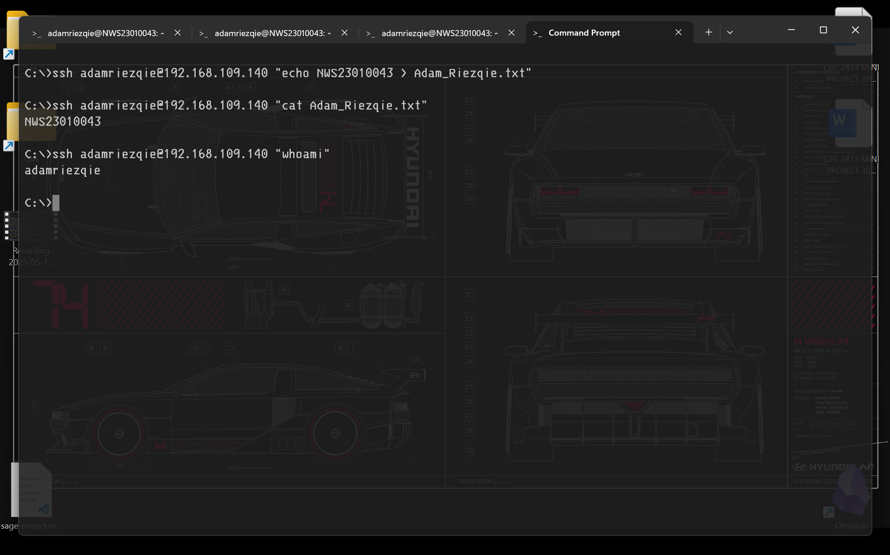

```bash
C:\>ssh-keygen -C "Adam Riezqie-NWS23010043"
Generating public/private ed25519 key pair.
Enter file in which to save the key (C:\Users\riezq/.ssh/id_ed25519):
Enter passphrase (empty for no passphrase):
Enter same passphrase again:
Your identification has been saved in C:\Users\riezq/.ssh/id_ed25519
Your public key has been saved in C:\Users\riezq/.ssh/id_ed25519.pub
The key fingerprint is:
SHA256:1mYVlOajpYA+9Fr/dv8IJZzxujMglg6trWYdBk/oXYE Adam Riezqie-NWS23010043
The key's randomart image is:
+--[ED25519 256]--+
|         . .o.   |
|        E . o.   |
|       o   +o    |
|      = o..o++   |
|     + BS++++.o  |
|      =.%o+  +   |
|       % + .o    |
|      = + . +o.. |
|     o..   oo+..+|
+----[SHA256]-----+

C:\>scp Users\riezq\.ssh\id_ed25519.pub adamriezqie@192.168.109.140:/home/abu/.ssh/authorized_keys
adamriezqie@192.168.109.140's password:
id_ed25519.pub                                                                       100%  107    52.2KB/s   00:00

C:\>
```

```bash
C:\>type Users\riezq\.ssh\id_ed25519.pub
ssh-ed25519 AAAAC3NzaC1lZDI1NTE5AAAAIM4yaBesI0LQUmNoiIpiBDqlKT2ghrzVfWdB6Zqg8Grf Adam Riezqie-NWS23010043
```

```bash
C:\>ssh adamriezqie@192.168.109.140
Linux NWS23010043 6.12.20-amd64 #1 SMP PREEMPT_DYNAMIC Kali 6.12.20-1kali1 (2025-03-26) x86_64

The programs included with the Kali GNU/Linux system are free software;
the exact distribution terms for each program are described in the
individual files in /usr/share/doc/*/copyright.

Kali GNU/Linux comes with ABSOLUTELY NO WARRANTY, to the extent
permitted by applicable law.
Last login: Fri May 16 19:03:05 2025 from 192.168.109.1
┌──(adamriezqie㉿NWS23010043)-[~]
└─$ # no password needed!

┌──(adamriezqie㉿NWS23010043)-[~]
└─$ echo "NWS23010043"> adam_riezqie.txt

┌──(adamriezqie㉿NWS23010043)-[~]
└─$ cat adam_riezqie.txt
NWS23010043

┌──(adamriezqie㉿NWS23010043)-[~]
└─$
```

```bash
C:\>ssh adamriezqie@192.168.109.140 "echo NWS23010043 > Adam_Riezqie.txt"

C:\>ssh adamriezqie@192.168.109.140
Linux NWS23010043 6.12.20-amd64 #1 SMP PREEMPT_DYNAMIC Kali 6.12.20-1kali1 (2025-03-26) x86_64

The programs included with the Kali GNU/Linux system are free software;
the exact distribution terms for each program are described in the
individual files in /usr/share/doc/*/copyright.

Kali GNU/Linux comes with ABSOLUTELY NO WARRANTY, to the extent
permitted by applicable law.
Last login: Fri May 16 19:16:29 2025 from 192.168.109.1
┌──(adamriezqie㉿NWS23010043)-[~]
└─$ whoami
adamriezqie

┌──(adamriezqie㉿NWS23010043)-[~]
└─$ cat Adam_Riezqie.txt
NWS23010043

┌──(adamriezqie㉿NWS23010043)-[~]
└─$
```

