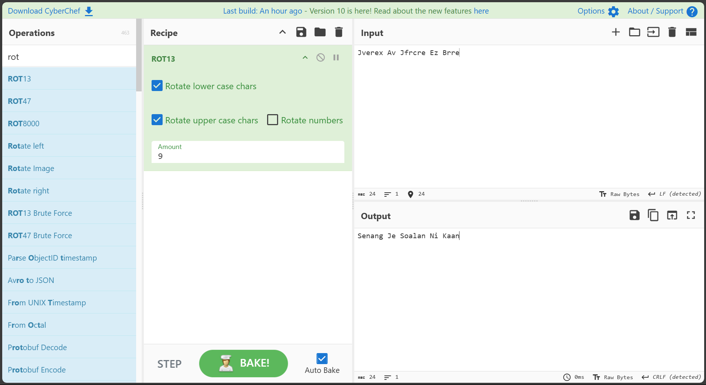
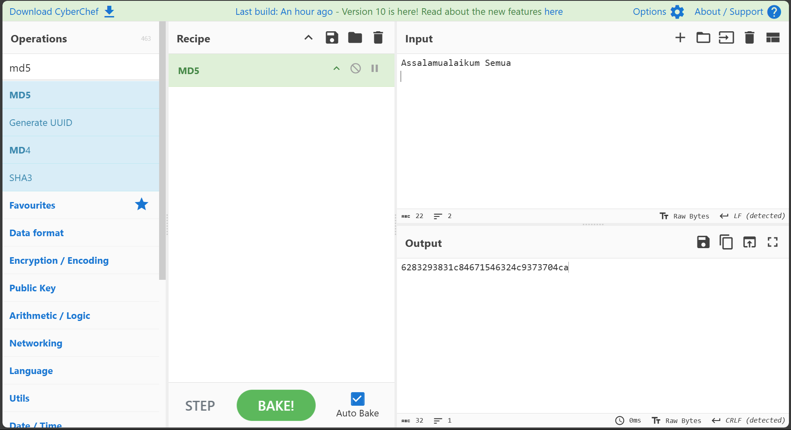

1. Hash 1 looks like base64 because it contain A-Z/a-z/0-9

- SnZlcmV4IEF2IEpmcmNyZSBFeiBCcnJl

```
┌──(adamriezqie㉿NWS23010043)-[~/…/4-Practical-Test/Practical-Test-1/src/Task-5]
└─$ echo "SnZlcmV4IEF2IEpmcmNyZSBFeiBCcnJl" | base64 -d
Jverex Av Jfrcre Ez Brre 
```


From here, we can assume the output has been rotate *base on my exp...
bring it to cyberchef lead I to ROT with value 9:


- Answer:`Senang Je Soalan Ni Kaan`

---
2. Here a bit tricky, I did it manually since I know there is problem with John The Ripper where by its not read or append new line \n
- 6283293831c84671546324c9373704ca

Give it try, on second wordlist I found the hash are the same.


else, i use python script found the match hash with \n append
```bash
┌──(adamriezqie㉿NWS23010043)-[~/…/4-Practical-Test/Practical-Test-1/src/Task-5]
└─$ python3 script-2.py
[+] Match found:
Plaintext: 'Assalamualaikum Semua\n'
MD5: 6283293831c84671546324c9373704ca
```


---

3. Same like previous question, I create a custom script
- 2bc92f33a2ede5ada3d65b468a81f617d0229d843d87c63313833e509e5a6782

```bash
┌──(adamriezqie㉿NWS23010043)-[~/…/4-Practical-Test/Practical-Test-1/src/Task-5]
└─$ python3 script-3.py
[+] Match found:
Plaintext: 'Begitulah Lumrah Kehidupan\n'
SHA-256: 2bc92f33a2ede5ada3d65b468a81f617d0229d843d87c63313833e509e5a6782
```
