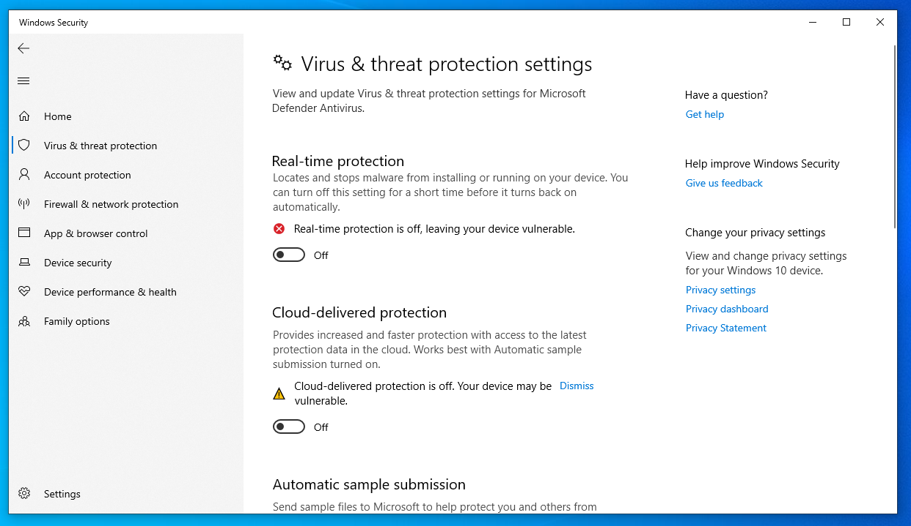
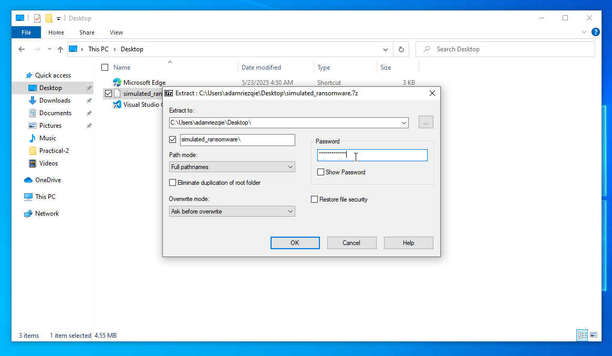
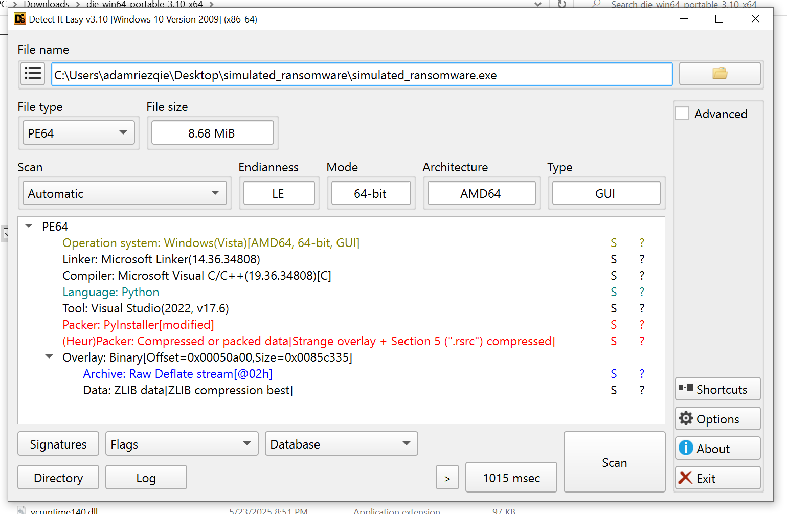
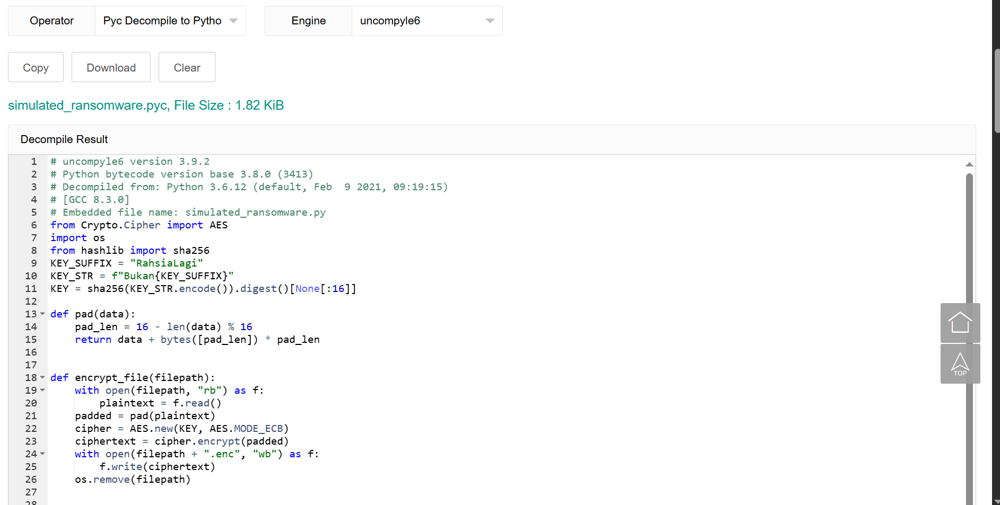
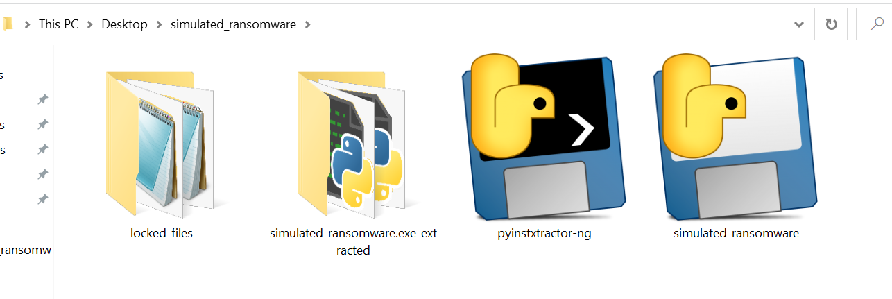
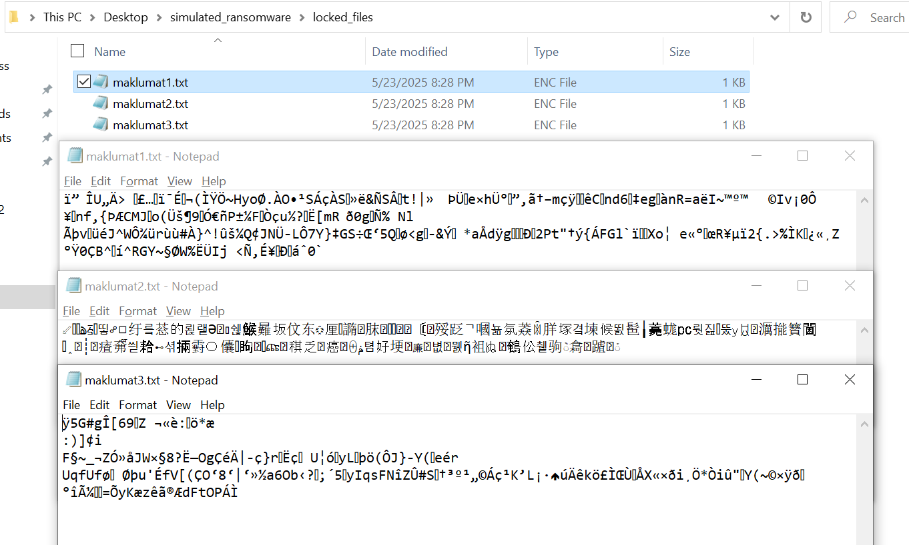
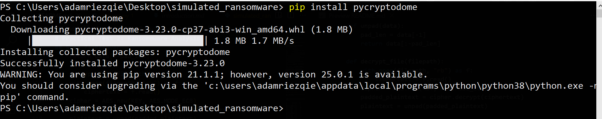
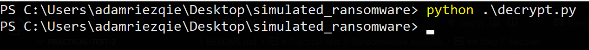
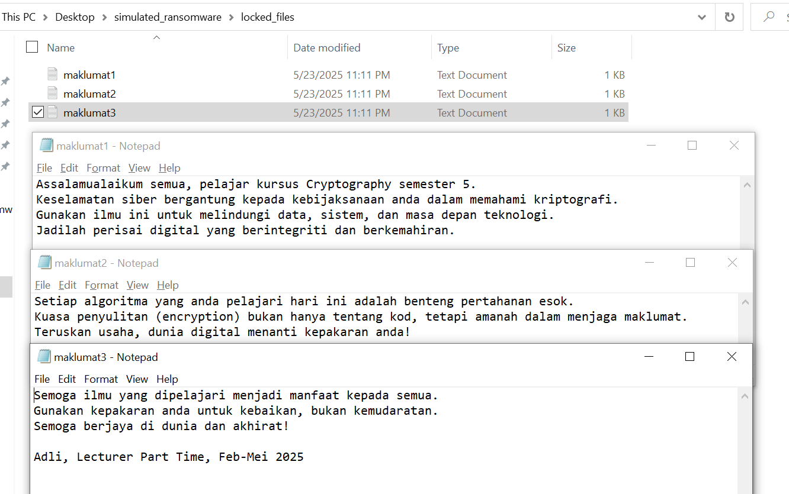

# Practical Test 2: ransomware Analysis

Yow chat, here is my walkthrough for performing ransomware analysis in Practical Test 2. You may read [the introduction](introduction.md) to better understand the objectives of this practical.

Before proceeding, you can refer to my [setup guide for performing malware analysis](src/notes/setup-guide-for-performing-malware-analysis.md).

## Step 1: Download The ransomware Zip File

Download the ransomware zip file here:
- [ransomware zip file](src/sample/simulated_ransomware.7z)

Zip Hash: `4BF1DA4E96EE6DD0306284C7F9CFE30F93113106843F2360052F8FEAF7B5578F`

Check using command `Get-FileHash .\simulated_ransomware.7z` on **Powershell**.

---

## Step 2: Turn Off Virus & Threat Protection
Make sure you turn off Virus Threat & Protection under: `Windows Security > Virus Threat & Protection > Manage Settings under Virus Threat & Protection Settings`




- **Real Time Protection:** `Turn Off`
- **Cloud-delivered Protection:** `Turn Off`
- **Automatic Sample Submission:** `Turn Off`
- **Tamper Protection:** `Turn Off`

---

## Step 3: Extract The ransomware Zip File
You need a [extract tools](src/notes/setup-guide-for-performing-malware-analysis.md#3-install-analysis-tools-inside-the-vm) to extract the zip file. For example here, I used [7z](https://www.7-zip.org/).



Password: `semogaberjaya`

---

## Step 4: Static Analysis
There is a difference between [static analysis and dynamic analysis](src/notes/type-of-analysis.md). Here we try to perform static analysis, which involves gathering as much information as possible before executing the file.

We can use tools like [DIE](src/notes/setup-guide-for-performing-malware-analysis.md#3-install-analysis-tools-inside-the-vm) to analyze it.



---

### Step 4.1: Reseach:
From the previous step, we know that the ransomware uses `Python Language` and is built using `PyInstaller`. Our goal is to understand how it works and reverse engineer it. By saying that, we need to identify the encryption algorithm, key, and any related information. This information can be obtained from the source code.

Since it is built using PyInstaller, I tried searching for `reverse engineer pyinstaller` on Google and found the tools on GitHub, [pyinstxtractor](https://github.com/extremecoders-re/pyinstxtractor) to extract the **binary file** from the `.exe`. You can download the `pyinstxtractor-ng.exe` [here](https://github.com/pyinstxtractor/pyinstxtractor-ng/releases/tag/2025.01.05).

`pyinstxtractor` *is a tool to extract the contents of a Pyinstaller generated executable file*. 

We maybe also need install python?

---

### Step 4.2: Extracting the Source Code from the Executable

Copy or move `pyinstxtractor-ng.exe` on the same directory with the ransomware:

```powershell
Directory: C:\Users\adamriezqie\Desktop\simulated_ransomware

Mode    LastWriteTime           Length     Name
----    -------------           ------     ----
-a----  5/23/2025  5:29 AM      8185302    pyinstxtractor-ng.exe
-a----  5/23/2025  8:01 PM      9096501    simulated_ransomware.exe                                                                                                                             
```

`--help` for see `pyinstxtractor-ng.exe` usage:


```powershell
PS C:\Users\adamriezqie\Desktop\simulated_ransomware> .\pyinstxtractor-ng.exe --help

usage: pyinstxtractor-ng.exe [-h] [-d] filename

PyInstaller Extractor NG

positional arguments:
  filename        Path to the file to extract

optional arguments:
  -h, --help      Show this help message and exit
  -d, --one-dir   One directory mode, extracts the pyz in the same directory as the executable
```

On **Powershell** we can run a **pyinstxtractor-ng.exe** to extract the source code using command `.\pyinstxtractor-ng.exe  .\simulated_ransomware.exe`

```powershell
PS C:\Users\adamriezqie\Desktop\simulated_ransomware> .\pyinstxtractor-ng.exe .\simulated_ransomware.exe

[+] Processing .\simulated_ransomware.exe
[+] PyInstaller version: 2.1+
[+] Python version: 3.8
[+] Length of package: 8,766,261 bytes
[+] Found 91 files in CArchive
[+] Beginning extraction... please standby

[+] Possible entry point: pyiboot01_bootstrap.pyc
[+] Possible entry point: pyi_rth_pkgutil.pyc
[+] Possible entry point: pyi_rth_inspect.pyc
[+] Possible entry point: pyi_rth_multiprocessing.pyc
[+] Possible entry point: pyi_rth_setuptools.pyc
[+] Possible entry point: pyi_rth_pkgres.pyc
[+] Possible entry point: simulated_ransomware.pyc

[+] Found 526 files in PYZ archive
[+] Successfully extracted PyInstaller archive: .\simulated_ransomware.exe

You can now use a Python decompiler on the .pyc files within the extracted directory.
```

From the succeful message *:You can now use a python decompiler on the pyc files within the extracted directory*. We know that `pyinstxtractor` extract the `simulated_ransomware.exe` to `.pyc`. We can comfirm it by go to **extracted directory**:

```powershell
PS C:\Users\adamriezqie\Desktop\simulated_ransomware> ls

Directory: C:\Users\adamriezqie\Desktop\simulated_ransomware

Mode    LastWriteTime           Length     Name
----    -------------           ------     ----
d-----  5/23/2025  9:40 PM                simulated_ransomware.exe_extracted
-a----  5/23/2025  5:29 AM      8185302    pyinstxtractor-ng.exe
-a----  5/23/2025  8:01 PM      9096501    simulated_ransomware.exe

PS C:\Users\adamriezqie\Desktop\simulated_ransomware> cd .\simulated_ransomware.exe_extracted\
```

Here we have `simulated_ransomware.pyc`:

```powershell
Directory: C:\Users\adamriezqie\Desktop\simulated_ransomware\simulated_ransomware.exe_extracted

Mode    LastWriteTime           Length  Name
----    -------------           ------  ----
-a----  5/23/2025  9:40 PM        875   pyiboot01_bootstrap.pyc
-a----  5/23/2025  9:40 PM       3015   pyimod01_archive.pyc
-a----  5/23/2025  9:40 PM      22889   pyimod02_importers.pyc
-a----  5/23/2025  9:40 PM       4019   pyimod03_ctypes.pyc
-a----  5/23/2025  9:40 PM       1100   pyimod04_pywin32.pyc
-a----  5/23/2025  9:40 PM       1584   pyi_rth_inspect.pyc
-a----  5/23/2025  9:40 PM       1122   pyi_rth_multiprocessing.pyc
-a----  5/23/2025  9:40 PM       4425   pyi_rth_pkgres.pyc
-a----  5/23/2025  9:40 PM        966   pyi_rth_pkgutil.pyc
-a----  5/23/2025  9:40 PM        779   pyi_rth_setuptools.pyc
-a----  5/23/2025  9:40 PM       1867   simulated_ransomware.pyc #Here bro!
-a----  5/23/2025  9:40 PM        311   struct.pyc

```

`.pyc` is a bytecode file created by the Python compiler when a `.py` file (source code) is imported or executed for the first time [google](https://www.google.com/search?q=whay+is+.pyc&ie=UTF-8).

Meaning that here we need a `python decompiler`. Bear in mind during the **extraction** we know that this ransomware uses `python 3.8`.

After googling about `python decompiler`, I found an [online tool](https://www.lddgo.net/en/string/pyc-compile-decompile) that is pretty useful in this case. But bear in mind, during malware **dynamic analysis**, it is best practice not to connect to the internet.

---

**Online decompiler:**

Make sure to choose:
- Operator: `Pyc Decompile to Python`
- Engine: `uncompyle6`



Simply download the to get the `.py` 

---

### Step 4.3 Reverse Enginering

From the source file here, we can take a deeper look to understand theoretically what this ransomware actually does:

```python
# uncompyle6 version 3.9.2
# Python bytecode version base 3.8.0 (3413)
# Decompiled from: Python 3.8.10 (tags/v3.8.10:3d8993a, May  3 2021, 11:48:03) [MSC v.1928 64 bit (AMD64)]
# Embedded file name: simulated_ransomware.py
from Crypto.Cipher import AES
import os
from hashlib import sha256
KEY_SUFFIX = "RahsiaLagi"
KEY_STR = f"Bukan{KEY_SUFFIX}"
KEY = sha256(KEY_STR.encode()).digest()[None[:16]]

def pad(data):
    pad_len = 16 - len(data) % 16
    return data + bytes([pad_len]) * pad_len


def encrypt_file(filepath):
    with open(filepath, "rb") as f:
        plaintext = f.read()
    padded = pad(plaintext)
    cipher = AES.new(KEY, AES.MODE_ECB)
    ciphertext = cipher.encrypt(padded)
    with open(filepath + ".enc", "wb") as f:
        f.write(ciphertext)
    os.remove(filepath)


if __name__ == "__main__":
    folder = "locked_files/"
    os.makedirs(folder, exist_ok=True)
    sample_files = [
     "maklumat1.txt", "maklumat2.txt", "maklumat3.txt"]
    contents = [
     "Assalamualaikum semua, pelajar kursus Cryptography semester 5.\nKeselamatan siber bergantung kepada kebijaksanaan anda dalam memahami kriptografi.\nGunakan ilmu ini untuk melindungi data, sistem, dan masa depan teknologi.\nJadilah perisai digital yang berintegriti dan berkemahiran.",
     "Setiap algoritma yang anda pelajari hari ini adalah benteng pertahanan esok.\nKuasa penyulitan (encryption) bukan hanya tentang kod, tetapi amanah dalam menjaga maklumat.\nTeruskan usaha, dunia digital menanti kepakaran anda!",
     "Semoga ilmu yang dipelajari menjadi manfaat kepada semua.\nGunakan kepakaran anda untuk kebaikan, bukan kemudaratan.\nSemoga berjaya di dunia dan akhirat!\n\nAdli, Lecturer Part Time, Feb-Mei 2025"]
    for name, content in zip(sample_files, contents):
        path = os.path.join(folder, name)
        with open(path, "w") as f:
            f.write(content)
        encrypt_file(path)

```

This script is a **simulated ransomware** written in Python. Its goal is to demonstrate how files can be encrypted using AES.

Let’s break it down step by step:

---

### 🔐 Importing Libraries

```python
from Crypto.Cipher import AES
import os
from hashlib import sha256
```

* `Crypto.Cipher.AES`: Used to perform AES encryption.
* `os`: File operations.
* `sha256`: Used to hash the encryption key.

---

### 🔑 Key Generation

```python
KEY_SUFFIX = "RahsiaLagi"
KEY_STR = f"Bukan{KEY_SUFFIX}"
KEY = sha256(KEY_STR.encode()).digest()[None[:16]]
```

* Concatenates `"BukanRahsiaLagi"` to form the key string.
* Hashes it with `SHA-256`.

---

### 📦 Padding Function

```python
def pad(data):
    pad_len = 16 - len(data) % 16
    return data + bytes([pad_len]) * pad_len
```

* AES in ECB mode requires data to be a multiple of 16 bytes.
* This function pads the plaintext using PKCS7-style padding.

---

### 🔒 File Encryption Function

```python
def encrypt_file(filepath):
    with open(filepath, "rb") as f:
        plaintext = f.read()
    padded = pad(plaintext)
    cipher = AES.new(KEY, AES.MODE_ECB)
    ciphertext = cipher.encrypt(padded)
    with open(filepath + ".enc", "wb") as f:
        f.write(ciphertext)
    os.remove(filepath)
```

* Reads the original file content.
* Pads it to match AES requirements.
* Encrypts using AES in **ECB mode** (not secure in practice).
* Saves the `.enc` file.
* Deletes the original plaintext file.

⚠️ ECB mode is **not secure for real-world encryption**. It’s used here for simplicity.

---

### 🏁 Main Execution Block

```python
if __name__ == "__main__":
```

This part simulates a basic ransomware behavior:

1. Creates a directory called `locked_files/`.
2. Prepares three `.txt` files with motivational messages.
3. Writes them to disk.
4. Encrypts each file immediately.

After execution, the `locked_files/` folder will only contain:

```
maklumat1.txt.enc
maklumat2.txt.enc
maklumat3.txt.enc
```

The original `.txt` files are deleted.

---

### 🔎 Summary

| Component        | Purpose                                        |
| ---------------- | ---------------------------------------------- |
| `KEY`            | Encryption key derived from a known string     |
| `pad(data)`      | Pads plaintext to match AES block size         |
| `encrypt_file()` | Encrypts and deletes original file             |
| `__main__` block | Simulates dropping and encrypting target files |

---

## Step 5: Run the ransomware

⚠️ **WARNING:** Make sure to **DISCONNECT** the network adapter before running the ransomware or performing the dynamic analysis to avoid unintended consequences.

To run the ransomware, locate the `simulated_ransomware.exe` file, then `Right click` and select `Open` or simply double click it.

---

## Step 6: Dynamic Analysis
Here, we try to perform **dynamic analysis** and **observe the behavior** of the ransomware. Specifically, we observe that it creates a folder named `locked_files`, generates text files with predefined content, encrypts these files using AES encryption, and deletes the original plaintext files.





Here is the file content if we try to open it with Notepad. Alternatively, you can use the `Get-Content` command on **Powershell**:

```powershell
PS C:\Users\adamriezqie\Desktop\simulated_ransomware\locked_files> Get-Content *
ï”☻ÎU„Ä> ☼£…↕ï¯É↨¬(ÌŸÖ~HyoØ.ÀO•¹SÁçÀS↓»ë&ÑSÂ♥t!|»       Þe×hÜ°↕”‚ã▼†–mçÿ►◄êC↨nd6eg§ànR=aëI~™º™       ©Iv¡0Ô¥‼nf,{ÞÆCMJ⌂o(܁š¶9♦Ó€ñP±¼F§Òçu½Ë[mR☻ð0g¶Ñ% Nl                  Ãþv↕üéJ^WÔ¾ürùù#À}^!ûš¼Q¢JNÜ­LÔ7Y}‡GS÷Œ‘5Q☼ø<g☺­&Ý☺⌂*aÅdÿg♦♣Ð♠2Pt"†ý{ÁFGl`Xo¦ e«°œR¥µï2{.>%ÌK«¸Z°Ÿ0ÇB^→í^RGY~§ØW%ËÜIj <Ñ‚É¥⌂Ð►áˆ0`                                      ♥ûä                                                                                   ªûm‼→ª{·                                                                              &û%¡~Œ¹×D„vµ¸±·Ø♦êøþ*VÂø›.;BW)O∟Nˆ♦˜ST©☼G}ðÞCÕó♫ë☼»ð¹è↑0´Úc<êG◄‼Vò±8EG¢˜⌂ZXj À¬∟X↓Pp¶òK}%§…Ö†v3↨¹ÎÉ♂ý°¶Yÿ÷¡«ñÿo":k|«•ý↨ð☻W÷                                                 %       Ü´?•6õ-‼Å €·"VÁšc4J0>Q¶§↨w’ìü‼ó↑zON×ÝLvqäY¤exÑ}YÂWIí¢ù¸èμ♦çx»Æ▼“ˆl0pâjOåÍyš▬j·é!H6ô:                                                                              ÿ5G#gÎ[69♠Z ¬«è:*æ                                                                   :)]¢∟i                                                                                F§~_¬ZÓ»åJWק8?Ë—OgÇéÄ|-ç}r♫Ëç♦ U¦ó↑yL↕þö(ԁJ}-Y(♣↔eér                                UqfUf Øþu'ÉfV[(ÇO‘8‘|‘»½a6Ob‹?↨;´5↓yIqsFNîZÛ#S♂†³º¹„©Á灹K’L¡·♀úÄêkö£ÌŒÙÅX«×ði¸Ö*Òiû♦Y(~©×ÿ°îü♂▼▬=ÕyKæzêã®ÆdFtOPÁÌ  
```

---

## Step 7: Recover
From the source code, we can reverse engineer and write a Python script to recover files that have been encrypted.

```python
from Crypto.Cipher import AES
from hashlib import sha256
import os

# Constants to match the original script
KEY_SUFFIX = "RahsiaLagi"
KEY_STR = f"Bukan{KEY_SUFFIX}"
KEY = sha256(KEY_STR.encode()).digest()[:16]  # Corrected the slicing here

def unpad(data):
    pad_len = data[-1]
    return data[:-pad_len]

def decrypt_file(filepath):
    with open(filepath, "rb") as f:
        ciphertext = f.read()
    cipher = AES.new(KEY, AES.MODE_ECB)
    padded_plaintext = cipher.decrypt(ciphertext)
    plaintext = unpad(padded_plaintext)
    
    # Save with original filename (removing .enc)
    original_filepath = filepath.replace(".enc", "")
    with open(original_filepath, "wb") as f:
        f.write(plaintext)
    os.remove(filepath)  # Optional: remove encrypted file after decryption

if __name__ == "__main__":
    folder = "locked_files/"
    for filename in os.listdir(folder):
        if filename.endswith(".enc"):
            decrypt_file(os.path.join(folder, filename))
```

To run this script, we need install `Python` and `pycryptodome`.



Run the script file:



And there you go:




