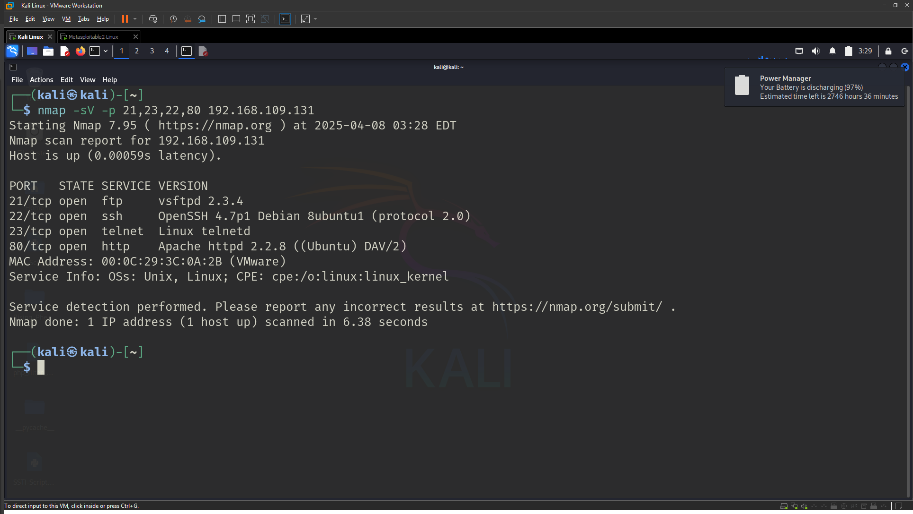
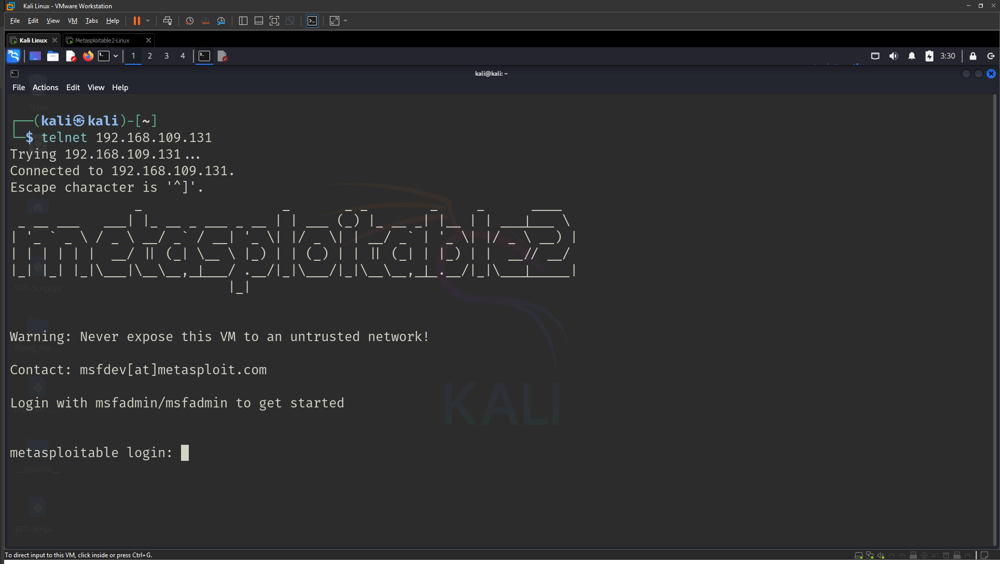
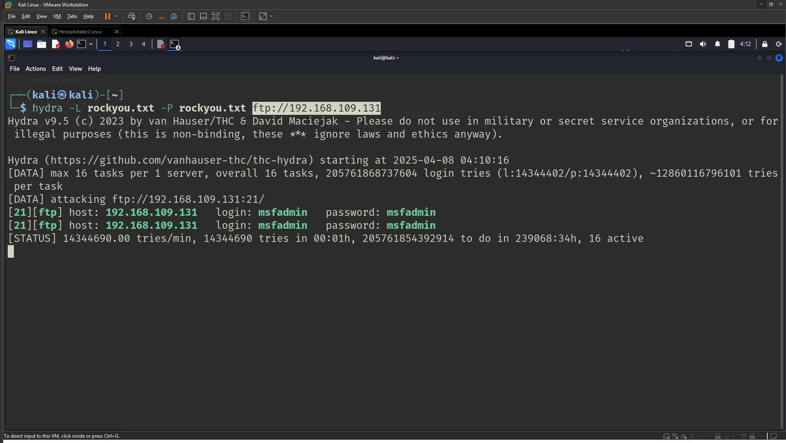
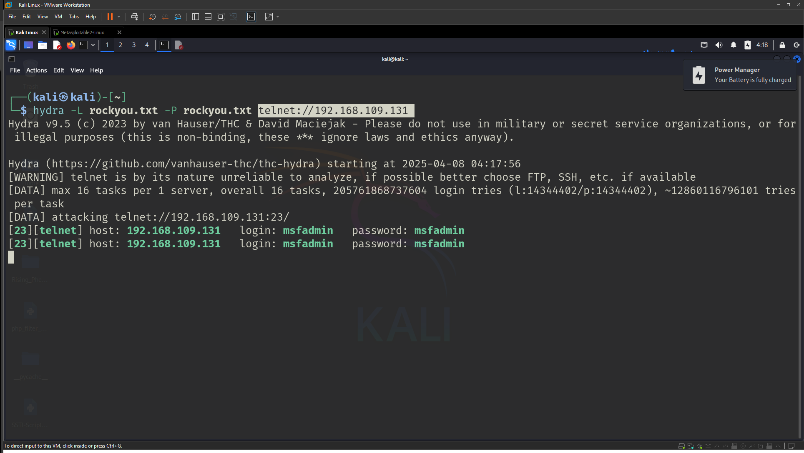

# Lab 1: Cryptographic Attacks: Brute Force and Traffic Analysis on Network Protocols

## 🎯 Objective
The goal of this lab is to explore the vulnerabilities of common network protocols (FTP, TELNET, SSH, HTTP) by performing brute force attacks to recover passwords and then using those credentials to sniff network traffic. Will also analyze the security of these protocols and propose mitigation strategies.

---

## 🛠️ Requirement

- Kali Linux       (Attacker)
- Metasploitable 2 (Target machine)
- Wordlist         (rockyou.txt with "msfadmin" word innit)
- Nmap
- Hydra
---

## 🔍 Lab Tasks

### 1. Enumerate the Vulnerable VM to Discover Usernames

#### ✅ Objective:
- Identify potential usernames for brute force attacks.
- Document the usernames found.

#### 🔧 Steps Taken:

- Performed a port scan using Nmap:
  ```
  nmap -sV -p 21,23,22,80 [target-ip]
  ```
  

- Connected manually to Telnet to observe any information:
  ```
  telnet [target-ip]
  ```
  
  > Here we got the username and password: ```msfadmin:msfadmin```. Bear in mind, we often do not get the credentials as easily as this.


---
### 2.  Perform Brute Force Attacks
#### 2.1. FTP, TELNET, and SSH

#### ✅ Objective:
- Use Hydra perform brute force attacks against the following protocols:

##### FTP
  ```
  hydra -L rockyou.txt -P rockyou.txt ftp://[target-ip]
  ```
  
  
##### TELNET
  ```
  hydra -L rockyou.txt -P rockyou.txt telnet://[target-ip]
  ```
  


